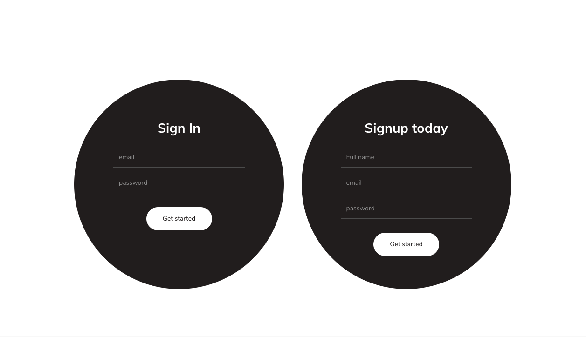
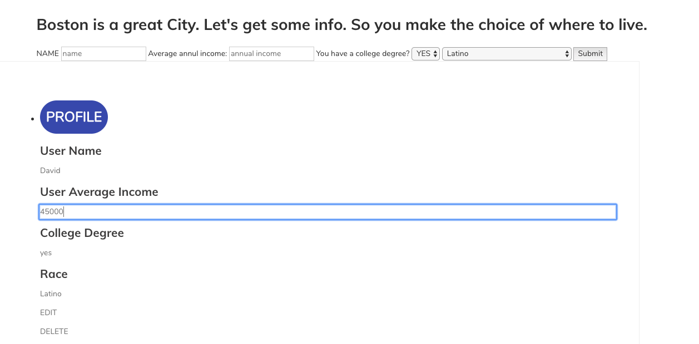

# ✅ A Full Stack DEMO DAY CRUD application
## myDomus is a Housing Activist application which gives users the resources they need to fuel their work and to connect and share with others.

Users are able to explore a map I made with Leaflet.js.  Which will give them a comparison between household income and race/ethnicity in Boston.  Users can than create profiles where they get custom homes according to max price.  

If they want to edit any information they simply click on it and hit the edit button.  

 In the back end I am running an Express framework with Node.js.  For my database I am using mongodb.  The mongo database is receiving DOM input from user logins and saving them to the database.  If you want to try it out follow the step bellow.  There are a-lot of new and exciting features coming soon!! Engaging maps and tons of data for your hearts desire! 🚀

## Tech Used:
- HTML5
- CSS3
- Javascript
- Leaflet.JS
- Node.js
- Express
- JSON API
- XML API
- Mongo DB

## Installation

1. Clone repo
2. run `npm install`

## Usage

1. run `node server.js`
2. Navigate to `localhost:8080`
3. Have fun ;)
