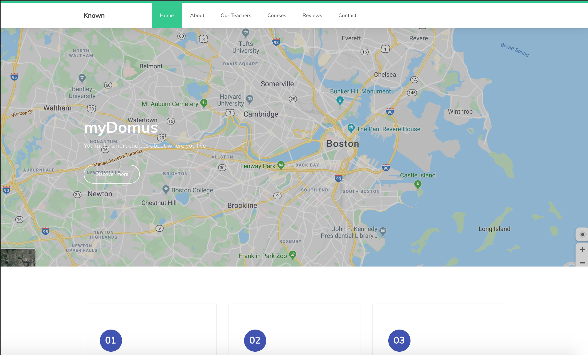

# ✅ A Full Stack CRUD application
# That allows user to input information and get results
# that allow for informed decisions on where to live

## Tech Used:
- HTML5
- CSS3
- Javascript
- Node.js
- Express
- Mongo DB

## Installation

1. Clone repo
2. run `npm install`

## Usage

1. run `node server.js`
2. Navigate to `localhost:8080`
3. Have fun ;)
